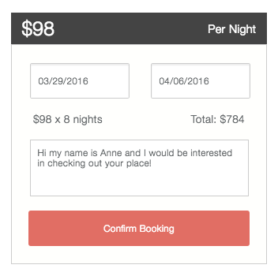
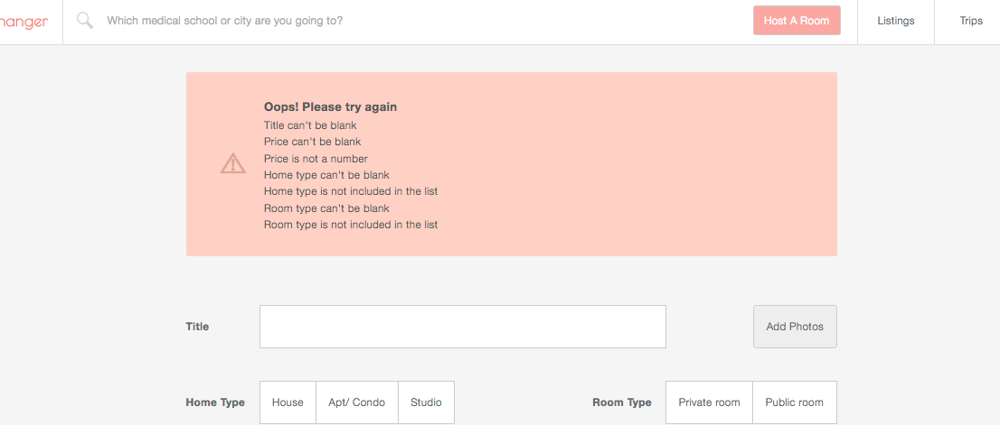

# RotationsExchanger

###[Live link](https://rx-rotations-exchanger.herokuapp.com)

RotationsExchanger is a web application designed for medical students to easily list and search for homes while on away clinical rotations. This full stack application is completed with Ruby on Rails and React.js. Inspiration for the application comes from [AirBnB](airbnb.com) and [RotatingRoom](RotatingRoom.com).

## Application Features

#### Location search and autocompletion of any address in full integration with Google Maps API
![autocomplete_landing]
![autocomplete_nav]

#### Dynamic filtering allowing users to mix and match compounded search parameters and receive instant updates
![filtered_search]

#### Vivid display of all photos, rooms and locations map in multiple selectable views catering to different user preferences
![slider_view] ![grid_view]
![maps]

#### Booking made easy with automatically calculated display of nights booked and total price

  

#### Complete single page application with authentication and instant error handling to provide a smooth user experience
![auth_feedback]

  

#### Management made easy for all account details
#####Listings
Dynamic display and update of all listings from the nav bar

  

All forms are custom designed to ensure intuitive use when adding, editing and deleting rooms and/or photos
![add_page]
![edit_page]

#####Requests easily approved or denied with instant status and page updates

    
    

  

#####Trips organized by status
![trips]

[add_form_feedback]: ./screenshots/add_form_feedback.png
[auth_feedback]: ./screenshots/auth_feedback.png
[search_filter]: ./screenshots/search_filter.png
[autocomplete_nav]: ./screenshots/autocomplete_nav.png
[autocomplete_landing]: ./screenshots/autocomplete_landing.png
[grid_view]: ./screenshots/grid_view.png
[slider_view]: ./screenshots/slider_view.png
[trips]: ./screenshots/trips.png
[requests_pending]: ./screenshots/requests_pending.png
[listings]: ./screenshots/listings.png
[filtered_search]: ./screenshots/filtered_search.png
[maps]: ./screenshots/maps.png
[edit_page]: ./screenshots/edit_page.png
[booking]: ./screenshots/booking.png
[add_page]: ./screenshots/add_page.png
[pending_request]: ./screenshots/pending_request.png
[approved_request]: ./screenshots/approved_request.png

## Technical Features

###Stack
* Ruby on Rails
* React.js
* Postgresql

###Models Schema
* Users
* Rooms
* Images
* Bookings

###APIs
* Google Maps API
* Cloudinary API
* Pusher Websocket API

###Modularized Components
React components are abstracted and grouped by logical similarity. This enables improved code maintainability and allows easy iterative design and development.

###Data Integrity
Integrated with React, the flux architecture provides real time reflection of all needed data from the database, allowing dynamic updates and minimal server requests.

## Todos
* refactor DateTime to single method in app context to improve code maintainability
* refactor index view for booking to use show partial
* set up browsing history in localStorage
* display trips and requests in carousel to improve UI

## Future Features
* **Google Calendar Integration:** save trips and requests to user calendar
* **Messaging model:** complete message history between guest and host for improved ease in trips/ request management
* **Availability model:** multiple date ranges for each listing's available dates, allowing user to list with more flexibility
* **Favorites model:** save listings for future trips

[views]: ./docs/views.md
[components]: ./docs/components.md
[stores]: ./docs/stores.md
[api-endpoints]: ./docs/api-endpoints.md
[schema]: ./docs/schema.md
